# Klinika
Pet prod Klinika with  Keycloak ( Spring Security OAuth2.0 ) 

1. Add container keycloak 
---------------------------------
docker run --name KEYCLOAK_TEST -p 8079:8080 -e KEYCLOAK_ADMIN=admin -e KEYCLOAK_ADMIN_PASSWORD=admin quay.io/keycloak/keycloak:25.0.1 start-dev

http://localhost:8079

login: admin
password: admin

----------------
create realm

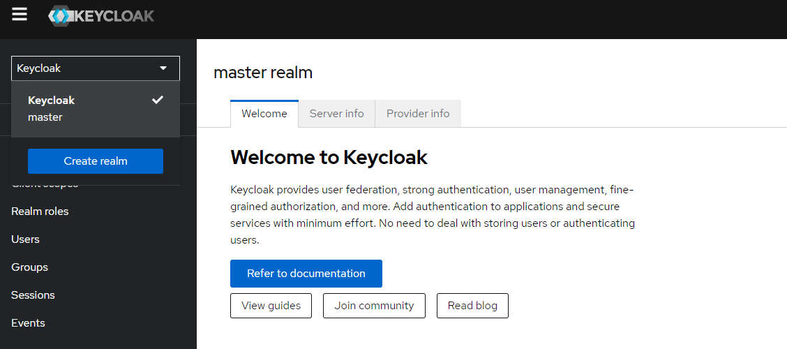

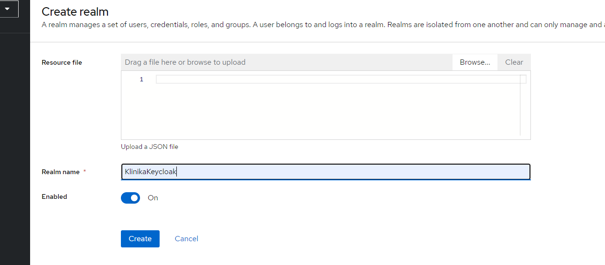

create client

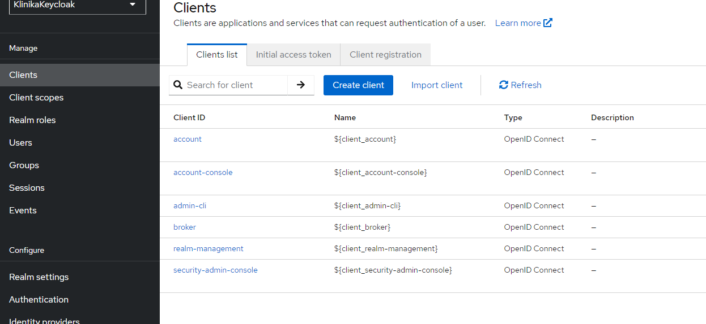

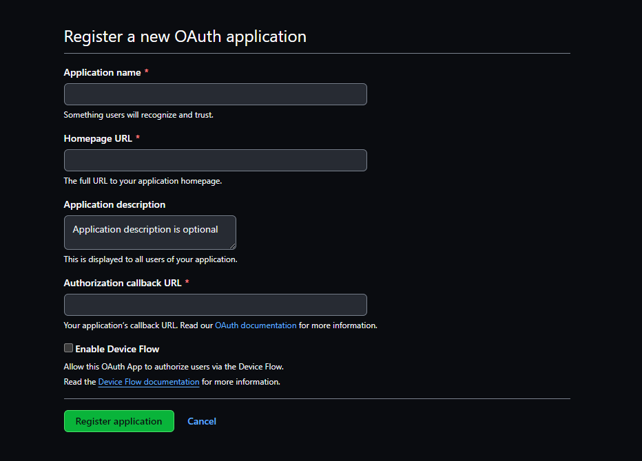

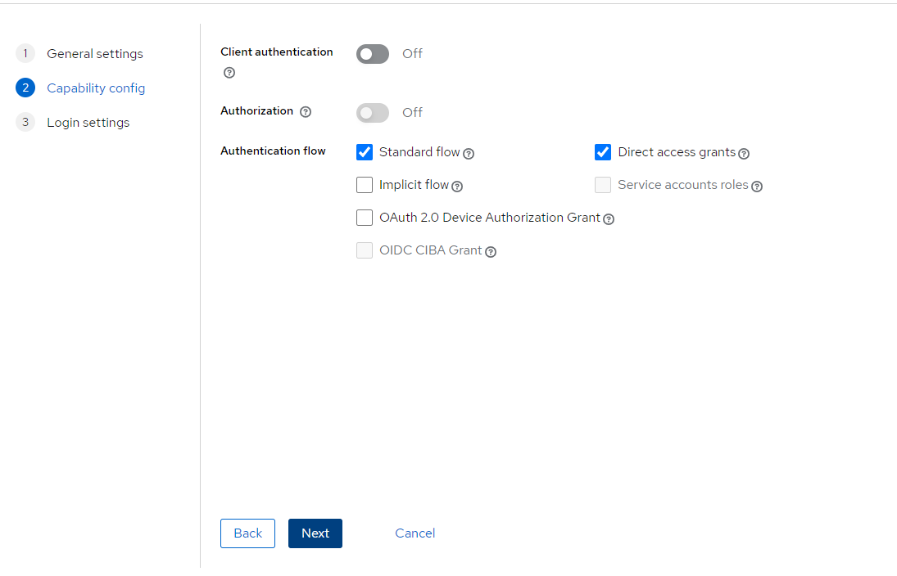

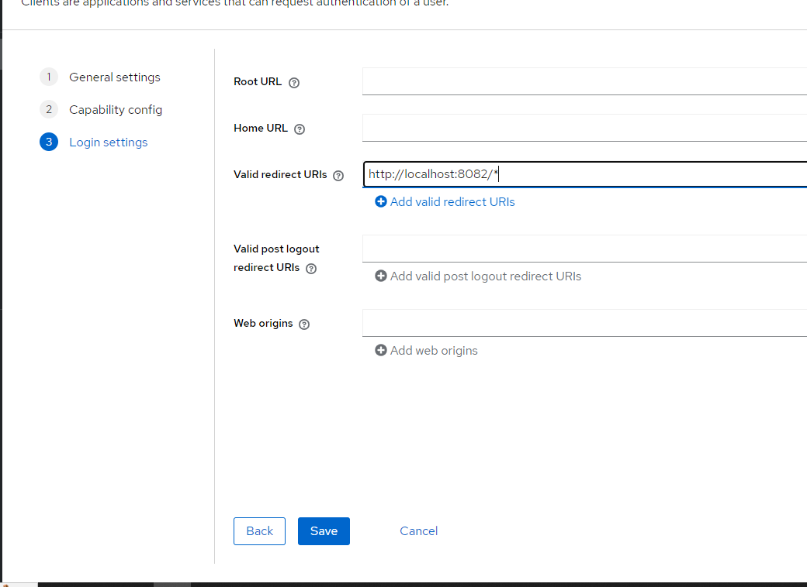

Client scopes -> microprofile-jwt ->( Default )

Create role 
-------------------
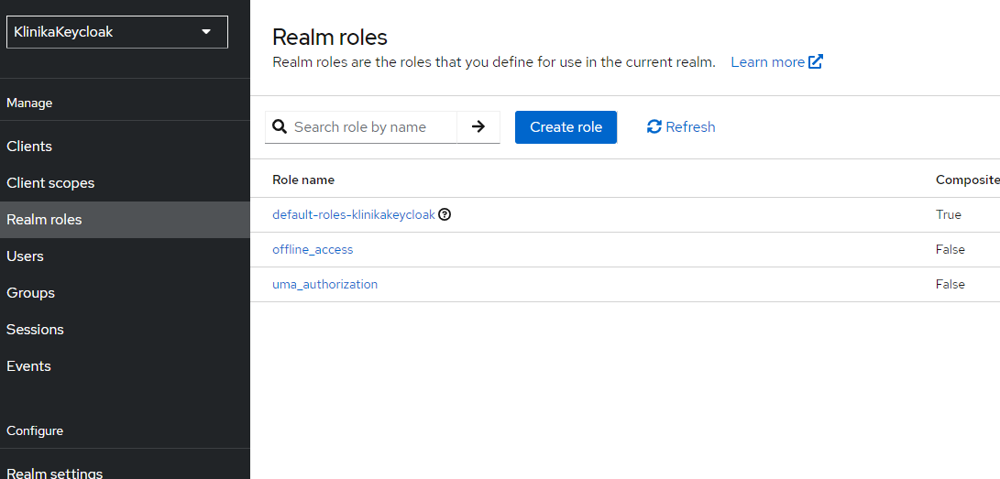

name: role_klinika

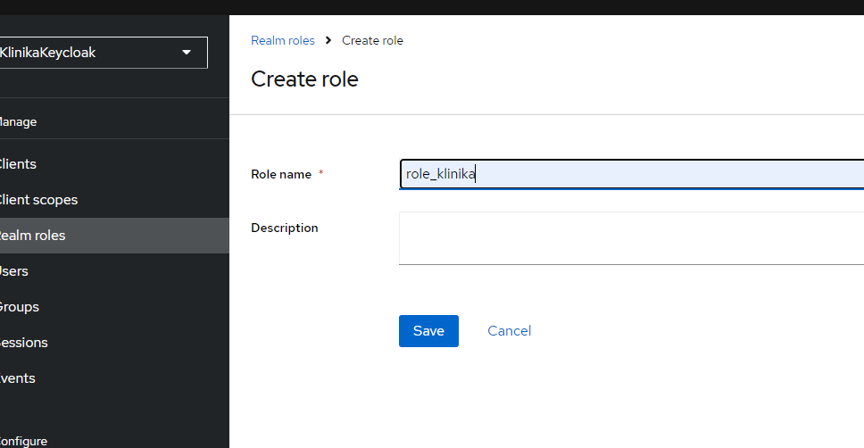

Create user
-------------------
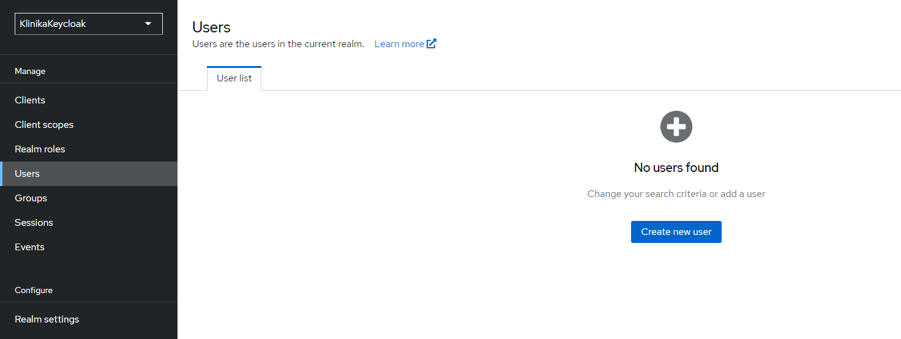

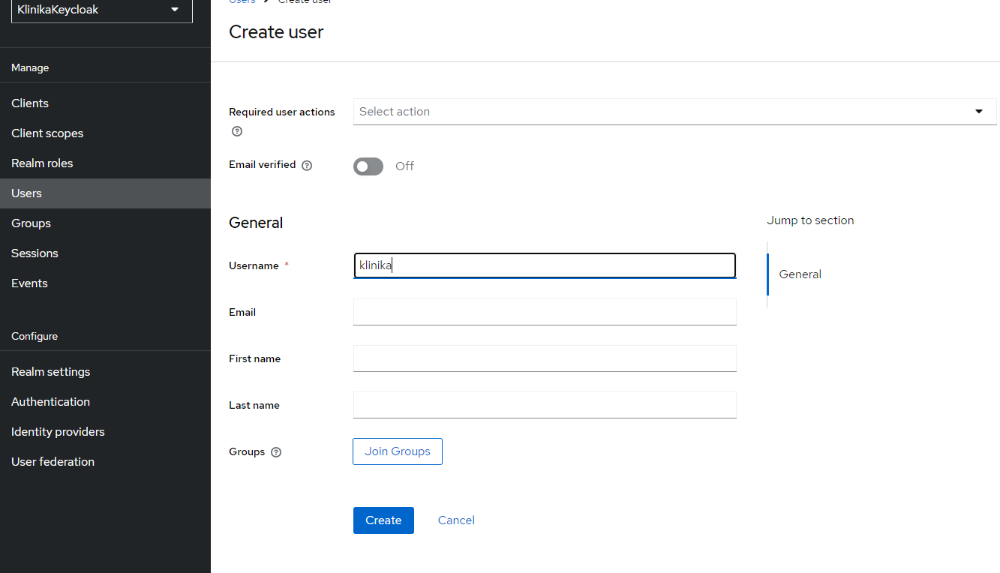

in the credentials add password

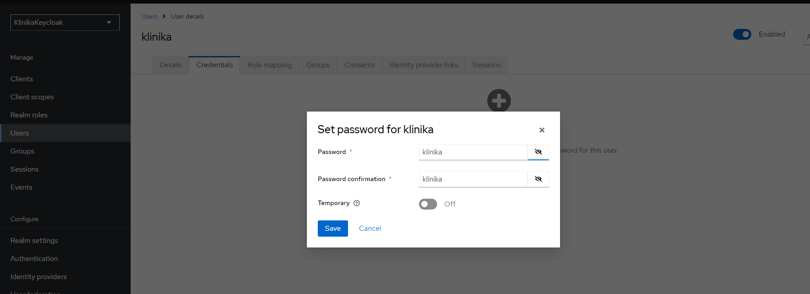

add role for user( klinika )

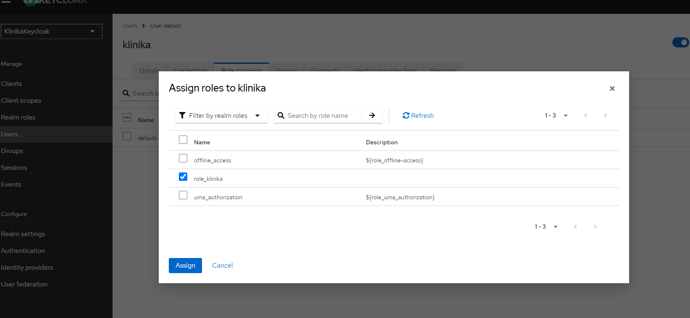
-----------------------------
Turn off "Verify profile" in "Authentication" -> "Required actions"

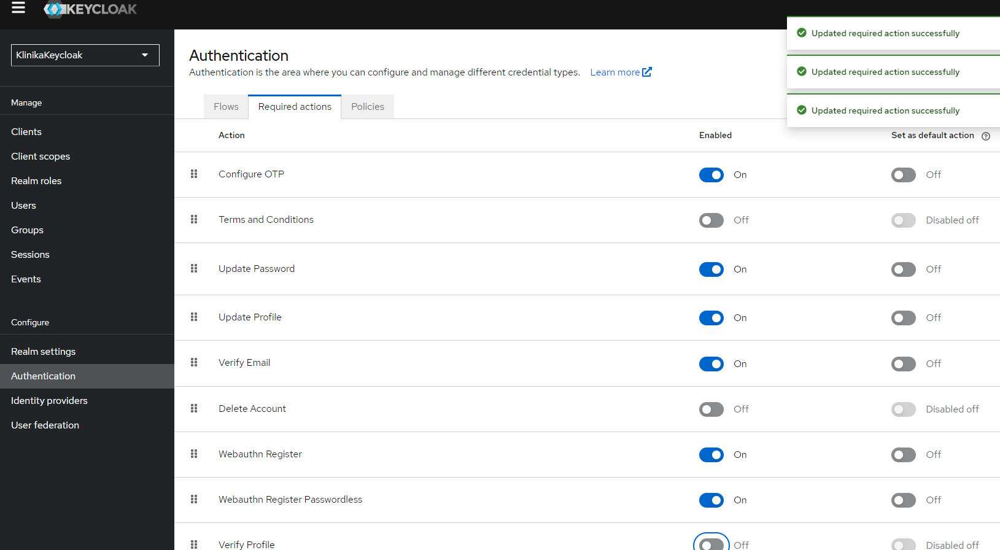

3. Check tocken in postman
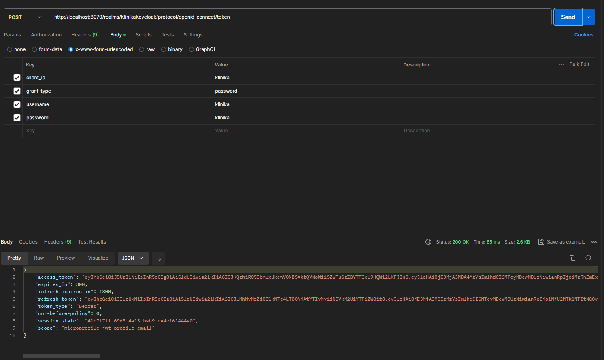

( http://localhost:8079/realms/KlinikaKeycloak/protocol/openid-connect/token )

2. Start app Klinika

into package "klinik"

3. open link http://localhost:8082/