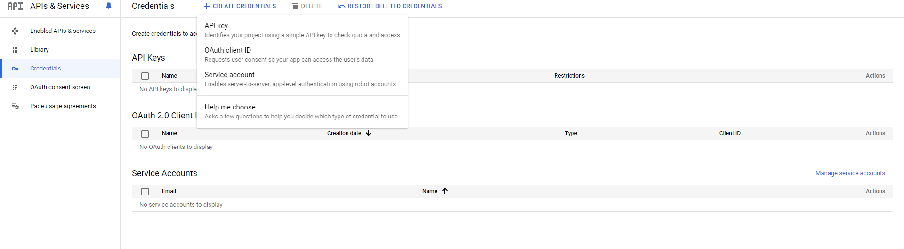

# Klinika
Pet prod Spring Boot 6 with OAuth via Google and GitHub

1. Add Credentia 
https://console.cloud.google.com/apis/credentials?project

The Redirect URI for Google is http://localhost:8082/login/oauth2/code/google

2. Add Client ID and secret into application-google.properties

3. Add https://github.com/settings/applications/new

The Callback URL for GitHub is http://localhost:8082/login/oauth2/code/github

4. Add https://oauth.mail.ru/app/

https://id.vk.com/about/business/go/docs/en/vkid/latest/oauth/oauth-mail/index#XOAUTH2