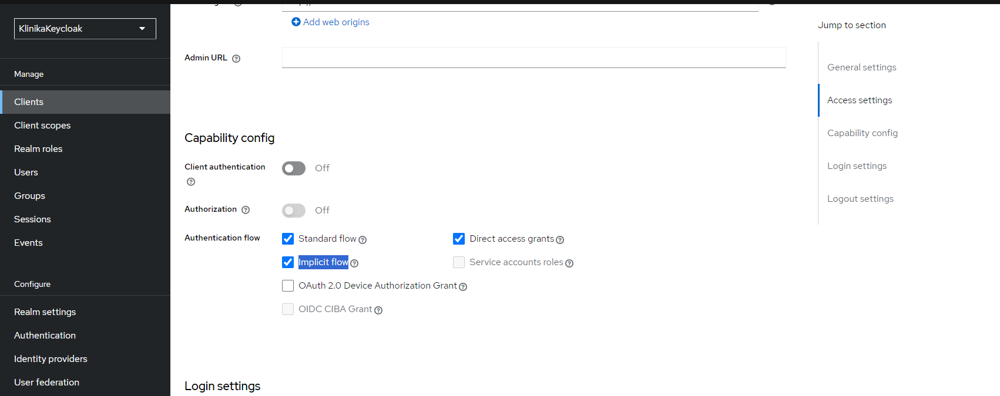
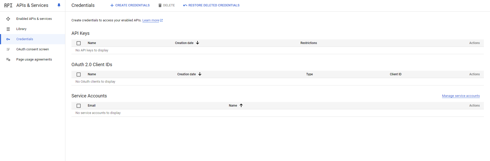
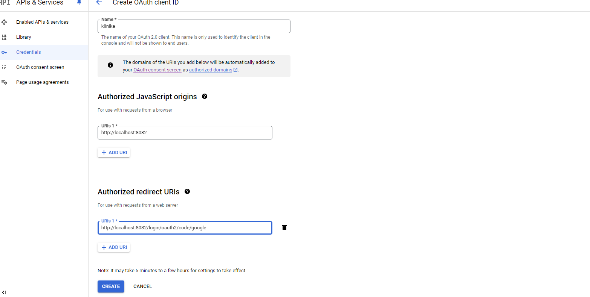

# Klinika
Pet prod Klinika with Keycloak ( JWT )

1. Add Keycloak
 
 Tutorial in https://github.com/Kirillkuss/klinik/blob/KeycloakOAuthClient/README.md

2. Add Clients -> klinika -> Settings (Authentication flow ) -> Implicit flow

3. Add Client scopes "full_access"

4. Add Client scopes to Clients "klinika" 

